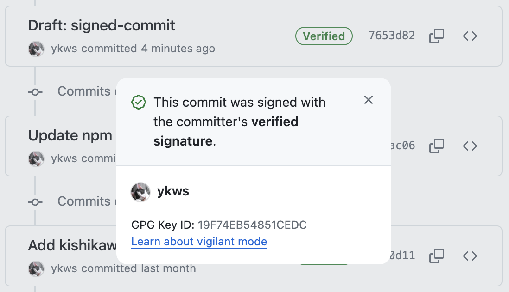
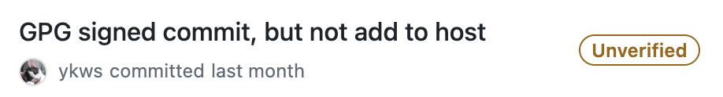
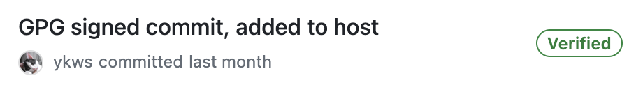
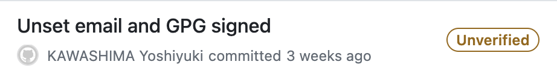
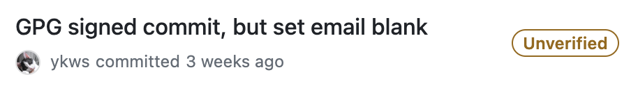

# Signed Commit Example

This is the standard commit I adhere to.

This repository contains a mix of unsigned and signed commits.
- Anonymous commit
- Set name commit
- Set email commit
- GPG signed commit, but not add to host
- GPG signed commit, added to host
- Unset email and GPG signed
- GPG signed commit, but set email blank

## Examples
### Anonymous commit

### Set name commit

### Set email commit

### GPG signed commit, but not add to host

### GPG signed commit, added to host

### Unset email and GPG signed

### GPG signed commit, but set email blank

